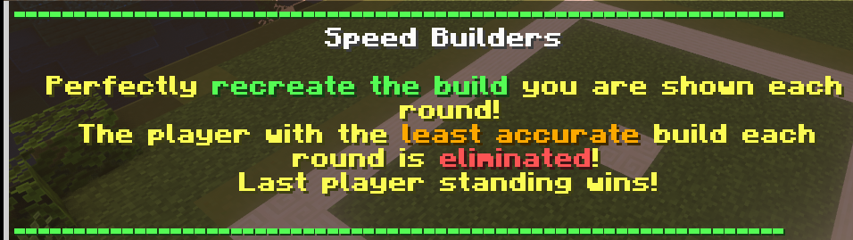
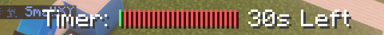
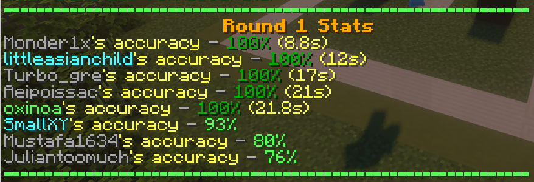

~~# 需求: 记忆速建

# 使用教程

* `/ssu setplayerspawn 6 speedbuild`    设置玩家出生点
* `/ssu setbuildregions 6 speedbuild `  设置建筑区域
* `/ssu setmiddleblock 6 speedbuild`    设置中心方块 
* `/ssu setislandregions 6 speedbuild`  设置岛屿区域

# 1. 原始需求
我想在一个小游戏里 弄三个模式，
一个就 是普通的速建，
第二 个是把速建的起始时 间变成25s加大难度
第三个是把八个岛屿弄成两个岛屿，然后人PK然后排行榜在第三个模式里
分别弄一个胜场榜，还有一个回合榜。然后胜场榜设定
成20回合以上才计入第一个模式里弄成四
人开启游戏然后就是输入指令能查询一个建筑的前十名的记录

# 2. 综合开发需求

* 普通模式
* 25s模式
* 2岛屿模式
* 人PK模式

# 速建玩法

MineCraft 记忆速建是指玩家在限定的时间内,仅依靠记忆来复刻 MineCraft 中的建筑或场景的一种玩法。

主要的玩法有:

1. 预先准备好一个建筑或场景的图片或视频,在限定的时间内(通常5-15分钟),玩家需要尽可能依靠记忆来还原场景。时间一到,然后比较建造的场景和原图的相似度。

2. 不提供任何参考图片,完全依靠玩家自己的记忆和想象力来建造。这需要玩家对游戏非常熟悉,知道不同方块的颜色、位置等细节。

3. 多人合作记忆速建。多个玩家一起依靠记忆来建造场景,可以发挥团队合作精神。

4. 实时记忆。主播在直播时建造场景,观众需要在限时内复刻主播的建筑。

这种玩法考验玩家的空间想象力、记忆力和手速,是最近两年比较流行的一种MineCraft创意玩法。需要玩家对方块的颜色、位置等细节烂熟于心,才能在限定时间内尽可能还原场景。这对玩家的综合能力有很好的锻炼效果。

# 插件需要实现的

场地区域设置
模板添加
游戏主进程
时间自由调节
排行榜
数据存储模式（Yaml）

# 哪些东西需要更改

- [x] 守卫者(NMS) 改EnderDragon 保留AI通过nms新new一个实体目标器 给EnderDargon转圈 玩家淘汰时隐藏主末影龙，生成2只末影龙并在玩家岛屿位置进行冲撞

- [x] 淘汰玩家1个改成2个 展示时转为一节异界展示并且固定时间 展示方块从下往上一行一行填充 移除展示方块从上往上一行一行移除 玩家飞行不再是二段跳(player.isFlying = true)

- [x] 展示 15s 放置从最底层放一秒放一层然后 控制在 6s  展示的时间 5s 取消展示是从顶上往下删

- [ ] 计分板格式增加变量 样式由服主自行更改

- [x] bar显示这样 不在显示毫秒（都管那个客户）

- [ ] 面朝方向的问题目前的面朝方向是死的不会旋转 应从展示与设定该建成的样式部分就已经旋转

- [x] 增加API功能支持岛屿样式UGC玩法

- [x] 审判增加时间计算审判要两人

- [x] 优化观战模式

- [x] 其他内容需要保持无BUG不更改

